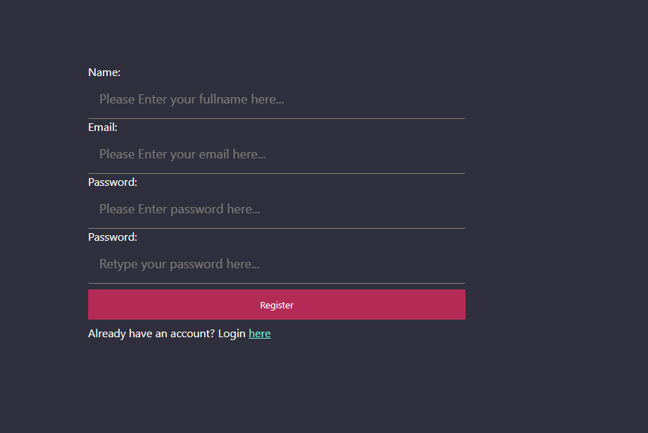
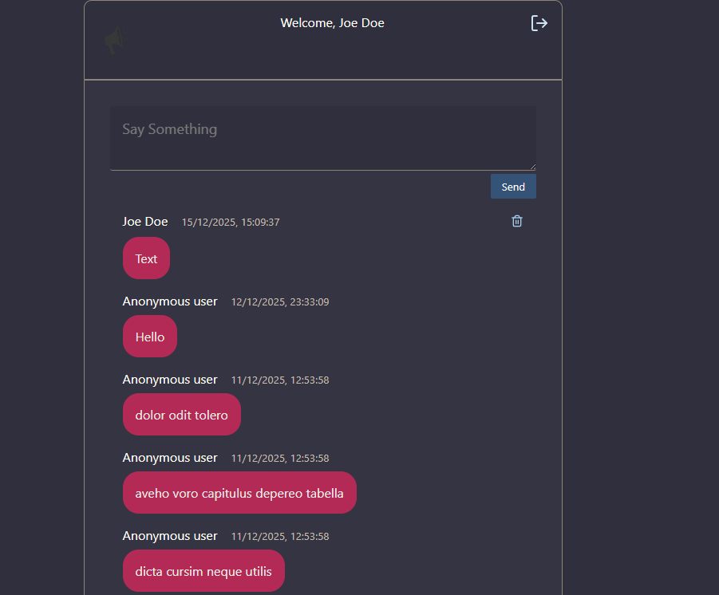

# 💬 Realtime Chat App (React + Appwrite)

A **real-time chat application** built with **React** and **Appwrite**, featuring authentication, live messaging, and role-based message deletion.  
The project demonstrates how to integrate Appwrite with a modern React app using Context API, React Router, and Tailwind CSS.

---

## 🌐 Live Demo

💬 **Try it here:**  
👉 https://realtime-chat-with-react-appwrite.vercel.app/

---

## ✨ Features

- 🔐 **Authentication**
  - User Registration
  - User Login / Logout
- 💬 **Realtime Chat Room**
  - Send messages in real time
  - Live updates using Appwrite Realtime subscriptions
- 🗑️ **Message Ownership**
  - Only the **message creator** can delete their message
- ⚡ **Modern Frontend Stack**
  - Context API for global auth state
  - React Router for page navigation
  - Tailwind CSS for styling
- 🚀 Built with **Vite** for fast development

---

## 📸 Screenshots

### Login Page


### Registration Page


### Chat Room



---

## 🛠️ Tech Stack

- **Frontend**
  - React
  - React Router
  - Context API
  - Tailwind CSS
- **Backend / BaaS**
  - Appwrite (Auth, Database, Realtime)
- **Tooling**
  - Vite
  - JavaScript (ES6+)
- **Hosting**
  - Vercel
---

## 🧠 Concepts Used

- Appwrite Authentication (Email & Password)
- Appwrite Databases & Permissions
- Appwrite Realtime subscriptions
- Protected routes with React Router
- Global state management using Context API
- Controlled forms in React

---

## ⚙️ Setup & Installation

### 1️⃣ Clone the repository
    ```bash
    git clone https://github.com/TasinTausif/realtime-chat-with-react-appwrite.git
    cd realtime-chat-with-react-appwrite

### 2️⃣ Install dependencies
    ```bash
    npm install
    
### 3️⃣ Configure Appwrite
    Create a .env file in the root directory:
    ```bash
    VITE_APPWRITE_ENDPOINT=https://cloud.appwrite.io/v1
    VITE_APPWRITE_PROJECT_ID=your_project_id
    VITE_APPWRITE_DATABASE_ID=your_database_id
    VITE_APPWRITE_COLLECTION_ID=your_collection_id

  - Make sure in Appwrite Console:
  - Web platform is added (localhost)
  - Proper read/write permissions are set for authenticated users
  - Real-time is enabled for the collection

### 4️⃣ Run the app
    ```bash
    npm run dev

---

## 🔐 Permissions Logic

  - Any authenticated user can:
  - Read messages
  - Send messages
  - Only the message creator can:
  - Delete their own message
  - This is enforced using Appwrite document permissions.
